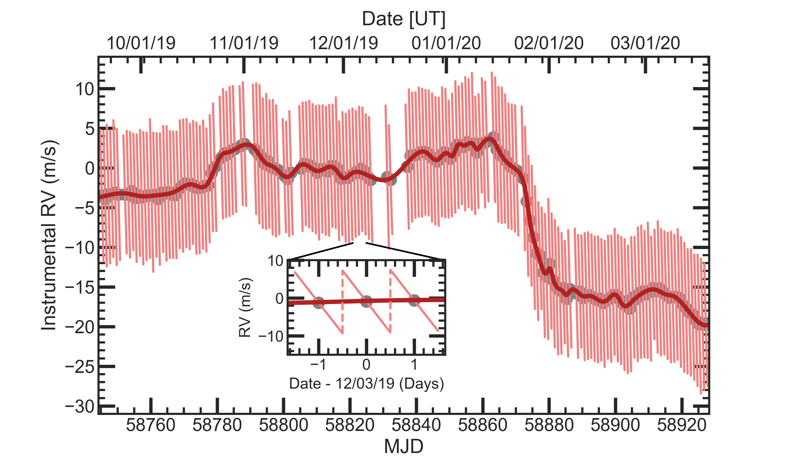

# Goldilocks_Documentation
**Habitable Planet Finder (HPF) Automatic Reduction Software**

*Goldilocks* is a an automatic pipeline for the HPF instrument at the Hobby Eberly Telescope (HET).  The pipeline reduces the previous night's data the following morning and provides users with reduced spectra to either adjust their program/targets or quickly turn observations into a scientific publication.  Although the primary goal of the software is to quickly reduce the HPF data products, we still aim to provide the highest quality reductions possible for both spectral and radial velocity analysis.  To that aim, please do not hesitate to contact the author below and provide feedback or make requests.

## Table of Contents

>[Working on TACC](https://github.com/grzeimann/Goldilocks_Documentation/blob/master/README.md#Working-on-TACC)

>>[Signing up for an account](https://github.com/grzeimann/Goldilocks_Documentation/blob/master/README.md#Signing-up-for-an-account)

>[Data Products](https://github.com/grzeimann/Goldilocks_Documentation/blob/master/README.md#Data-Products)

>[Documentation](https://github.com/grzeimann/Goldilocks_Documentation/blob/master/README.md#Documentation)

>>[Reduction Steps](https://github.com/grzeimann/Goldilocks_Documentation/blob/master/README.md#Reduction-Steps)

>>>[Slope Image](https://github.com/grzeimann/Goldilocks_Documentation/blob/master/README.md#Slope-Image)

>>>[Spectral Extraction](https://github.com/grzeimann/Goldilocks_Documentation/blob/master/README.md#Spectral-Extraction)

>>>[Goldilocks vs HPF Team Reduction](https://github.com/grzeimann/Goldilocks_Documentation/blob/master/README.md#Goldilocks-vs-HPF-Team-Reduction)

>>>[Radial Velocity Corrections](https://github.com/grzeimann/Goldilocks_Documentation/blob/master/README.md#Radial-Velocity-Corrections)

>>>[Examples](https://github.com/grzeimann/Goldilocks_Documentation/blob/master/README.md#Examples)

>[Telluric Correction](https://github.com/grzeimann/Goldilocks_Documentation/blob/master/README.md#Telluric-Correction)

>[Author](https://github.com/grzeimann/Goldilocks_Documentation/blob/master/README.md#Author)

## Working on TACC 
The reductions are designed to be run on TACC where a copy of the raw data lives.  We will describe how to get started on TACC, where the automatic reduction products reside.

### Signing up for an account
https://portal.tacc.utexas.edu/
<p align="center">
  
</p>

After creating an accounting using the link above, please send Greg Zeimann <gregz@astro.as.utexas.edu> your TACC username and he will add you to the HET group.  When that step is complete, you can ssh into TACC using:
```
ssh -Y USERNAME@stampede2.tacc.utexas.edu
```

## Data Products
*Goldilocks* is run each morning 11:30am.  The run time varies on cpu availability and the amount of data, but the reductions should finish by 1pm or so.  An accompanying email from the HET astronomer will alert the user that target(s) were observed the previous night and data reductions are (or will be soon) available.  The data products are in the following path:
```
/work/03946/hetdex/maverick/HPF/PROGRAM-ID
```
where PROGRAM-ID, is your program number, for example HET20-3-999.  To get all of the current reductions for your program, simply:
```
scp -r username@stampede2.tacc.utexas.edu:/work/03946/hetdex/maverick/HPF/PROGRAM-ID .

OR on the destination machine:

cd PROGRAM-ID
rsync -avz username@stampede2.tacc.utexas.edu:/work/03946/hetdex/maverick/HPF/PROGRAM-ID/ .
```
You merely have to use your "username" and your "PROGRAM-ID" and you can copy over your products.  There is a small complication.  The data products in your "PROGRAM-ID" folder include the products of the HPF team as well as the new automatic pipeline.  Products released from the HPF team occur on a quarterly basis (every three months or so) and include the naming scheme:
```
Slope-DATETIME_R01_OBSID.fits [SLOPE AND VARIANCE IMAGE]
Slope-DATETIME_R01_OBSID.optimal.fits [SCIENCE, SKY, AND CAL SPECTRA]
```
For information on the HPF products please see: 

https://psuastro.github.io/HPF/HPF-First-Data-Release-Documentation/

Products from *Goldilocks* are produced daily and have the naming scheme:
```
Goldilocks-DATETIME_v01_OBSID.fits [SLOPE AND VARIANCE IMAGE]
Goldilocks-DATETIME_v01_OBSID.spectra.fits  [SCIENCE, SKY, AND CAL SPECTRA]
```
The "V01" refers to the version of Goldilocks used.

```
Goldilocks-DATETIME_v01_OBSID.fits:

0. Primary Header
1. Slope image (e-/sec)
2. Error of the slope image (e-/sec)
```

The spectra fits file includes 9 extensions and a primary extension containing the header.  Note that Goldilocks' spectra store the error and not the variance, unlike the standard HPF team's reduction.
```
Goldilocks-DATETIME_v01_OBSID.spectra.fits:

0. Primary Header
1. Science fiber flux in units of (e-/sec)
2. Sky fiber flux in units of (e-/sec)
3. Calibration fiber flux in units of (e-/sec)
4. Science fiber error in units of (e-/sec)
5. Sky fiber error in units of (e-/sec)
6. Calibration fiber error in units of (e-/sec)
7. Science fiber’s wavelength per pixel (Vacuum wavelength in Angstroms)
8. Sky fiber’s wavelength per pixel (Vacuum wavelength in Angstroms)
9. Calibration fiber’s wavelength per pixel (Vacuum wavelength in Angstroms)
```

A png output is also included:
```
Goldilocks-DATETIME_v01_OBSID.spectra.png
```
which plots the sci, sky, and cal fibers in blue, orange, and green respectively.  The plots also include the median S/N for each order.  The png file is quite large to allow for sufficient zoom to peak up on any given feature.

## Documentation

### Reduction Steps
#### Slope Image
Much of the code for generating slope images is originally from the pyhxrg module in HxRGproc by Ninan et al. (in prep).  The algorithms of which are based on Ninan et al. (2018)[https://ui.adsabs.harvard.edu/abs/2018SPIE10709E..2UN/abstract].

```
Slope and Error Image Generation:

1. Subtract first frame from all frames in the data cube
2. Subtract even and odd reference pixels on the 4 pixel border
3. Subtract linear model using top and bottom reference pixels within a channel
4. Apply non-linear correction using polynomial model with input counts and output corrected counts
5. Mask values above 30,000 ADU
6. Multiply by gain
7. Calculate slope image (e-/s) which is average change in counts from frame to frame
8. Remove residual bias in each channel and then over all rows using residual in border pixels from slope image
9. Calculate error image (e-/s) using Robberto 2010 (Eq 7) and applying a square root
10. Subtract 2D 2nd order polynomial to remove scattered light
11. Divide slope and error image by flat field; this results in zeros outside of the fiber model region (+/-7 pixels) for each order (zero values are masked pixels)
```

We combine Alpha Bright exposures over many nights to make a single master frame for all three fibers.  This master frame is used to model the trace of the fibers, the fiber profile for each fiber and order as a function of column, and to remove flat fielding features.  Below is a zoom-in of the hpf_trace_image.fits frame in the calibrations folder.  The three fibers (sky, sci, and cal) are marked, as well as flat-fielding features which are removed for science frames.

<p align="center">
  
</p>

#### Spectral Extraction
```
Extracted Spectra for Sky, Sci, and Cal Fibers:

1. Measure trace from master Alpha Bright image
2. Build a fiber profile as a function of column for each fiber and order using the master Alpha Bright image
3. Evaluate the profile for each fiber and order at each column and use the profile for optimal extraction
4. spectrum[fiber][order][column] = sum(profile * data * mask / variance) / sum(profile^2 * mask / variance) [Horne 1986]
```

We use the master Alpha Bright image to build a trace solution (5th order polynomial) for each fiber and order.  We then build the fiber profile along the trace, again for each fiber and order as function of column.  An example of the fiber profiles are shown below for different orders.

<p align="center">
  
</p>

We use Horne (1986) and the simple formula in step 4 to calculate the spectrum as function of column.  **Note that we erroneously do not rectify the spectra before we extract.**  This results in a mismatch between the expected fiber profile for the column and the data due to the data being tilted perpendicular to the trace.  This can be as large of a tilt as 6% for some orders.  The benefits of rectification before extraction are obvious but time consuming (flux-conserving algorithms can take up to an hour for each observation).  For now, Goldilocks makes this known error in extraction for speed over accuracy.  We plan to undertake the investigation to find what impact this extraction has on the accuracy and precision of rv analyses.  Programs with a focus on flux estimations will see very little impact from this extraction method.

#### Goldilocks vs HPF Team Reduction
We compare our extractions to those of the HPF team and find quite good agreement.  After subtracting off the sky fiber from the science fiber for each order, we typically agree to <1% and agree on average at the 0.5% level.  The mismatch and offset between the two reductions is likely due to differences in flat-fielding corrections, fiber profile estimates, and rectification before extraction.

<p align="center">
  
</p>

#### Radial Velocity Corrections
**Note: all observations have the same wavelength solution while instrumental drifts and barycentric corrections are modeled, put in the header, and left to the users to correct the wavelength solutions.**

We model the Laser Frequency Comb (LFC) for the calibration fiber throughout the night to infer the instrumental radial velocity correction needed for a given scientific observation.  The radial velocity change throughout the night is sufficiently modeled with a linear regression and the results of which are shown in:
```
/work/03946/hetdex/maverick/HPF/CALS/{DATE}_rv.png
```

The typical correction ranges from -10 to 10 m/s.  The inferred correction is stored in the header as **LRVCORR**.  **A value of 0.0 exactly indicates a failure in the instrumental rv correction.  These will be addressed using a longer period model as discussed below to aid on failed nights** We show the instrument RV modeling for 01/07/2020 below.  Note that the ticks for the date-time line up with the ticks for the modified julian date and occur on the hour.

<p align="center">
  
</p>

Longer trends in the instrumental drift can be seen as well.  Here we show an analysis of the RV shift from late September 2019 to March 2020.  Missing dates either had a failed analysis or were insufficiently covered by laser frequency comb (LFC) exposures.  There is a sawtooth shape to each day that can be seen on the zoom in.  The origin is discussed extensively in Metcalf et al. (2019), and it is related to the weight of the liquid nitrogen tank between re-fills.  Over a period of weeks you can see drifts in the instrumental RV and a strong correlation between the intercept of a given night and its neighbors.  This allows us to model nights with missing LFC data.  In this plot we simply use a smoothing spline to capture the drift over these 6 months.  *Since Goldilocks is run each morning, this long term analysis is not applied to the reductions but could be provided if requested.*

<p align="center">
  
</p>

We also estimate the barycentric radial velocity correction similarly to the following example code which draws on astropy's modules (EarthLocation, SkyCoord, Time):
```
loc = EarthLocation.of_site('McDonald Observatory')
sc = SkyCoord(RA, Dec)
t = Time(begin+length/2.)
vcorr = sc.radial_velocity_correction(kind='barycentric', obstime=t, location=loc)
```
The barycentric radial velocity correction is stored in the header as **BRVCORR**.  We expect this correction to have some error as we don't use the exact geographical location of the HET and rather use the McDonald Observatory.  We also don't calculate the flux-weighted average time for each order but instead just use the time at the middle of the exposure.

#### Examples
Here we are showing a twilight spectrum for each of the 28 orders.  The three colors: blue, orange, and green, correspond to the three fibers: sci, sky, and cal.  This ".png" is available for each reduced source.

<p align="center">
  
</p>

## Telluric Correction

We take a non-parametric modeling approach to telluric corrections by contructing a principal component basis for physically motivated models from TelFit (Gullikson et al. 2014).

```
Continuum estimation:

1. Using a default telluric model, identify and mask wavelengths with tranmission <98.5% (where 100% is zero absorption).
2. For each order, using 100 bins for the 2040 data points, calculate the 50th-% for the given bin ignoring masked values.  
   If all data points in a bin are masked, the bin is ignored in the next process.
3. Linearly interpolate between each bin (including extrapolation for the end points) to construct our continuum model.  
```

We accomplished this approach in two steps.  First we constructed a coarse grid of TelFit models, fit a PCA basis to the grid, fit our telluric standard star observations, determined the average telluric absorption, fit a PCA basis to the residuals of that model, then refit our standard stars.  

First we collected all telluric star observations from Jan-2021 through Sep-2021, totalling 126 observations.  We constructed a grid of TelFit models for three parameters: airmass, O2, and H2O.  This grid is rather coarse with only three points for airmass (min, median, and maximum airmass for the HET), three points for O2 (0.5e5, 2e5, and 3.5e5), and finally 8 points for H20 (ranging from 0-100% humidity).  This 72 point grid covers the phase space of expected telluric absorption at the HET.  It is far too coarse for individual modeling purposes, but more than sufficient to construct our inital PCA basis. We built a PCA model with 15 components from our 72 point grid to fit each of our 126 stars.  


## Author
Greg Zeimann

**HET Data Scientist**

*grzeimann@gmail.com* or *gregz@astro.as.utexas.edu*


